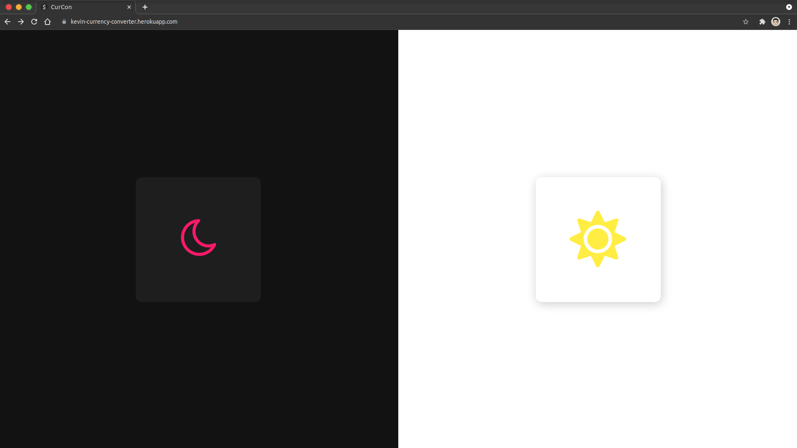
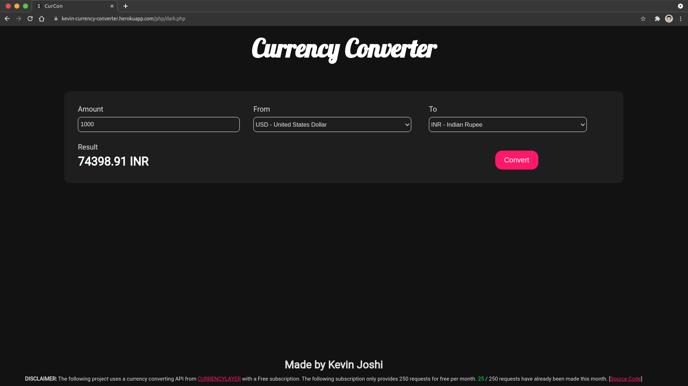
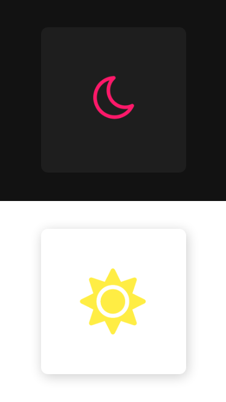
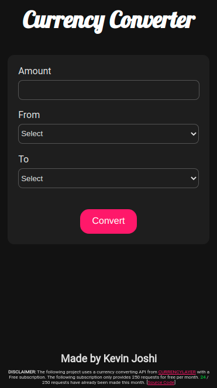
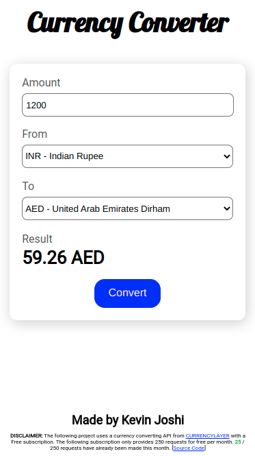

# CURRENCY CONVERTER

This is a project made by [Kevin Joshi](https://github.com/KevinJ-hub)  

There is an **easter egg** 🥚️ added to this project that will unlock extended functionality.  
**HINT:** You will have to use dev tools to find it out 😉️  

The web app has dark as well as light mode 🌚️>>>🌝️  
The whole website has been made flexible and has been developed for desktop and mobile devices  
The following project uses a currency converting API from [CURRENCYLAYER](https://currencylayer.com/) with a free subscription  

> **NOTE:** The api is used with a free subscription which has a limit of 250 requests per month so only 250 request will be served per month. (The count of requests made can be found at the bottom of the app)

## Tech Used

- HTML
- CSS
- PHP
- PostgreSQL

## Running this project  

1. Clone the repository in the XAMP or LAMP's respective directory
2. Add the environment variables from the env-sample file
3. Open the index file in browser

## Images

### Desktop

---

---

### Mobile Devices

|  |  |  |
|---|---|---|
